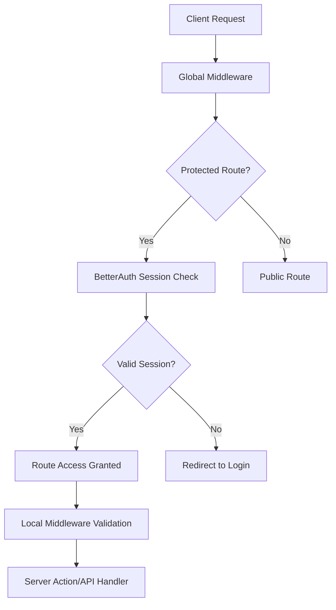

# Authentication & Authorization

The SaaS Starter includes a comprehensive authentication system built on [BetterAuth](https://www.better-auth.com) with multi-tenant organization support and social authentication providers.

## Overview

Our authentication system provides:

- **Multi-tenant Organizations**: Users can belong to multiple organizations with different roles
- **Social Authentication**: Google, Facebook, LinkedIn, and TikTok OAuth providers
- **Role-based Access Control**: Owner and member roles with granular permissions
- **Session Management**: Secure session handling with automatic refresh
- **Server-side Protection**: Middleware-based route protection and validation

## Quick Links

### 📋 Implementation Guides

- **[Server Authorization Overview](./server-authorization-overview)** - Request lifecycle, guard registry, and session caching helpers
- **[Server Actions & Hooks](./server-actions-and-hooks)** - Patterns for validated server actions, API handlers, and typed client fetchers
- **[OAuth Setup](./OAUTH_SETUP)** - Social authentication provider configuration

### 🔑 Key Features

- **BetterAuth Integration**: Modern authentication library with TypeScript support
- **Organization Management**: Multi-tenant architecture with role-based permissions
- **Social Providers**: Pre-configured OAuth flows for major platforms
- **Security Middleware**: Request-level protection and validation
- **Type Safety**: Full TypeScript coverage for authentication flows

### 🚀 Getting Started

1. **Environment Setup**: Configure your OAuth provider credentials
2. **Database Migration**: Run migrations to set up authentication tables
3. **Provider Configuration**: Set up social authentication providers
4. **Test Authentication**: Use the seeded test user to verify functionality

## Architecture

The authentication flow ensures secure access to protected routes while maintaining a smooth user experience for public content.
