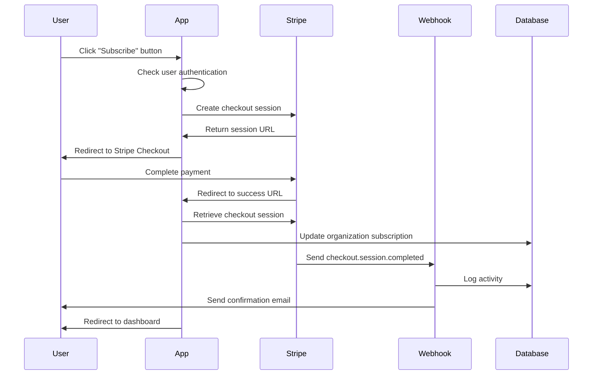

# Stripe Checkout and Billing Portal

## Overview

This document covers the implementation of Stripe Checkout sessions and Customer Portal (billing portal) functionality in the SaaS application. These features provide a complete subscription management experience for customers.

## Stripe Checkout

### Implementation

**Core Function**: `createCheckoutSession({ priceId })` in `lib/payments/stripe.ts`

**API Route**: `app/api/stripe/checkout/route.ts` (post-checkout processing)

**Server Action**: `checkoutAction(formData)` in `lib/payments/actions.ts`

### Checkout Flow



### Checkout Session Configuration

```typescript
const stripeSession = await stripe.checkout.sessions.create({
  payment_method_types: ['card'],
  line_items: [
    {
      price: priceId,
      quantity: 1,
    },
  ],
  mode: 'subscription',
  success_url: `${env.BASE_URL}/api/stripe/checkout?session_id={CHECKOUT_SESSION_ID}`,
  cancel_url: `${env.BASE_URL}/pricing`,
  client_reference_id: user.id.toString(),
  allow_promotion_codes: true,
  subscription_data: {
    trial_period_days: 14,
  },
});
```

#### Key Configuration Options

- **`payment_method_types`**: Only card payments supported
- **`mode`**: Set to 'subscription' for recurring billing
- **`client_reference_id`**: User ID for post-checkout processing
- **`allow_promotion_codes`**: Enables discount code usage
- **`trial_period_days`**: 14-day free trial for all subscriptions

### Authentication Handling

```typescript
export async function createCheckoutSession({ priceId }: { priceId: string }) {
  const session = await auth.api.getSession({
    headers: await headers(),
  });

  const user = session?.user;

  if (!user) {
    redirect(`/sign-up?redirect=checkout&priceId=${priceId}`);
  }

  // Create checkout session...
}
```

**Behavior**:

- Unauthenticated users are redirected to sign-up
- Price ID is preserved in redirect URL
- After authentication, user returns to checkout flow

### Post-Checkout Processing

The `/api/stripe/checkout` route handles successful checkouts:

#### 1. Session Validation

```typescript
const session = await stripe.checkout.sessions.retrieve(sessionId, {
  expand: ['customer', 'subscription'],
});

if (!session.customer || typeof session.customer === 'string') {
  throw new Error('Invalid customer data from Stripe.');
}
```

#### 2. Subscription Data Extraction

```typescript
const subscription = await stripe.subscriptions.retrieve(subscriptionId, {
  expand: ['items.data.price.product'],
});

const plan = subscription.items.data[0]?.price;
const product = plan.product;
```

#### 3. Database Updates

```typescript
await db
  .update(organization)
  .set({
    stripeCustomerId: customerId,
    stripeSubscriptionId: subscriptionId,
    stripeProductId: stripeProductId,
    planName: productName,
    subscriptionStatus: subscription.status,
  })
  .where(eq(organization.id, membership[0].organizationId));
```

#### 4. Redirect to Dashboard

Successful processing redirects users to the main dashboard:

```typescript
return NextResponse.redirect(new URL(APP_BASE_PATH, request.url));
```

### Frontend Integration

The checkout flow is triggered from pricing cards:

```tsx
// In PricingCard component
<form action={checkoutAction}>
  <input type="hidden" name="priceId" value={price.id} />
  <Button type="submit" className="w-full">
    {isCurrentPlan ? 'Current Plan' : 'Subscribe Now'}
  </Button>
</form>
```

**Server Action**:

```typescript
export const checkoutAction = withOrganization(async (formData) => {
  const priceId = formData.get('priceId') as string;
  await createCheckoutSession({ priceId });
});
```

## Customer Portal (Billing Portal)

### Implementation

**Core Function**: `createCustomerPortalSession(organization)` in `lib/payments/stripe.ts`

**Server Action**: `customerPortalAction(formData, organization)` in `lib/payments/actions.ts`

### Portal Configuration

#### Dynamic Configuration Creation

```typescript
let configuration: Stripe.BillingPortal.Configuration;
const configurations = await stripe.billingPortal.configurations.list();

if (configurations.data.length > 0) {
  configuration = configurations.data[0];
} else {
  // Create new configuration
  configuration = await stripe.billingPortal.configurations.create({
    business_profile: {
      headline: 'Manage your subscription',
    },
    features: {
      subscription_update: {
        enabled: true,
        default_allowed_updates: ['price', 'quantity', 'promotion_code'],
        proration_behavior: 'create_prorations',
        products: [
          {
            product: product.id,
            prices: prices.data.map((price) => price.id),
          },
        ],
      },
      subscription_cancel: {
        enabled: true,
        mode: 'at_period_end',
        cancellation_reason: {
          enabled: true,
          options: [
            'too_expensive',
            'missing_features',
            'switched_service',
            'unused',
            'other',
          ],
        },
      },
      payment_method_update: {
        enabled: true,
      },
    },
  });
}
```

#### Portal Features

1. **Subscription Updates**:
   - Plan changes (upgrade/downgrade)
   - Quantity adjustments
   - Promotion code application
   - Prorated billing calculations

2. **Subscription Cancellation**:
   - Cancel at period end (no immediate termination)
   - Cancellation reason collection
   - Customer feedback capture

3. **Payment Method Management**:
   - Add/remove payment methods
   - Set default payment method
   - Update billing information

### Session Creation

```typescript
return stripe.billingPortal.sessions.create({
  customer: organization.stripeCustomerId,
  return_url: appReturnUrl,
  configuration: configuration.id,
});
```

### Access Requirements

```typescript
export const customerPortalAction = withOrganization(
  async (_, organization) => {
    const portalSession = await createCustomerPortalSession({
      stripeCustomerId: organization.stripeCustomerId ?? null,
      stripeProductId: organization.stripeProductId ?? null,
    });
    redirect(portalSession.url);
  }
);
```

**Requirements**:

- User must be authenticated
- User must belong to an organization
- Organization must have a Stripe customer ID
- Organization must have an active product

### Frontend Integration

Portal access is provided through billing pages:

```tsx
// In billing page or settings
<form action={customerPortalAction}>
  <Button type="submit">Manage Billing</Button>
</form>
```

### Return URL Configuration

```typescript
const baseUrl = (env.BASE_URL ?? '').replace(/\/$/, '');
const appReturnUrl = baseUrl ? `${baseUrl}${APP_BASE_PATH}` : APP_BASE_PATH;
```

Customers return to the main dashboard after portal session.

## Error Handling

### Checkout Errors

#### Invalid Price ID

```typescript
// Validation occurs in Stripe API call
// Application handles with user-friendly error page
return NextResponse.redirect(new URL('/error', request.url));
```

#### Authentication Issues

```typescript
if (!user) {
  redirect(`/sign-up?redirect=checkout&priceId=${priceId}`);
}
```

#### Database Update Failures

```typescript
try {
  await db.update(organization).set(subscriptionData);
} catch (error) {
  console.error('Error handling successful checkout:', error);
  return NextResponse.redirect(new URL('/error', request.url));
}
```

### Portal Errors

#### Missing Customer Data

```typescript
if (!organization.stripeCustomerId || !organization.stripeProductId) {
  redirect('/pricing');
}
```

#### Inactive Products

```typescript
const product = await stripe.products.retrieve(organization.stripeProductId);
if (!product.active) {
  throw new Error("Organization's product is not active in Stripe");
}
```

#### Configuration Errors

```typescript
const prices = await stripe.prices.list({
  product: product.id,
  active: true,
});
if (prices.data.length === 0) {
  throw new Error("No active prices found for the team's product");
}
```

## Testing

### Test Scenarios

#### Checkout Flow

1. **Successful Subscription**:

   ```
   User: Unauthenticated
   Action: Click "Subscribe" → Sign up → Complete checkout
   Expected: Subscription created, user redirected to dashboard
   ```

2. **Existing User Subscription**:

   ```
   User: Authenticated, no subscription
   Action: Click "Subscribe" → Complete checkout
   Expected: Subscription created, organization updated
   ```

3. **Promotion Code Usage**:
   ```
   User: Any
   Action: Apply valid promotion code during checkout
   Expected: Discount applied, subscription created with discount
   ```

#### Portal Flow

1. **Plan Upgrade**:

   ```
   User: Has active subscription
   Action: Access portal → Change to higher plan
   Expected: Subscription updated, prorated charge applied
   ```

2. **Plan Downgrade**:

   ```
   User: Has active subscription
   Action: Access portal → Change to lower plan
   Expected: Subscription updated, credit applied
   ```

3. **Subscription Cancellation**:

   ```
   User: Has active subscription
   Action: Access portal → Cancel subscription
   Expected: Subscription canceled at period end
   ```

4. **Payment Method Update**:
   ```
   User: Has active subscription
   Action: Access portal → Update payment method
   Expected: New payment method saved and set as default
   ```

### Test Cards

Use Stripe test cards for different scenarios:

```bash
# Successful payment
4242 4242 4242 4242

# Declined payment
4000 0000 0000 0002

# Requires 3D Secure
4000 0027 6000 3184

# Insufficient funds
4000 0000 0000 9995
```

### Local Testing

```bash
# Start application
pnpm dev

# Test checkout flow
# 1. Go to /pricing
# 2. Click subscribe button
# 3. Complete test checkout
# 4. Verify webhook processing

# Test portal flow
# 1. Complete a subscription first
# 2. Go to /app/billing
# 3. Click "Manage Billing"
# 4. Test portal features
```

## Security Considerations

### Checkout Security

1. **Authentication Required**: All checkout sessions require authenticated users
2. **Price Validation**: Price IDs validated against Stripe
3. **User Context**: Client reference ID prevents session hijacking
4. **Secure Redirects**: All redirects use application-controlled URLs

### Portal Security

1. **Organization Validation**: Portal access requires organization membership
2. **Customer Ownership**: Customer ID must belong to user's organization
3. **Session Expiration**: Portal sessions have limited lifetime
4. **Return URL Control**: Return URLs restricted to application domain

### Data Protection

1. **No Card Storage**: No payment data stored in application
2. **Minimal PII**: Only necessary customer data synchronized
3. **Encrypted Transit**: All Stripe communication over HTTPS
4. **Webhook Verification**: All webhook events cryptographically verified

## Monitoring and Analytics

### Key Metrics

Track these metrics for checkout and portal usage:

1. **Checkout Metrics**:
   - Conversion rate (visits to subscriptions)
   - Abandonment rate
   - Average time to complete
   - Payment method distribution

2. **Portal Metrics**:
   - Portal access frequency
   - Plan change frequency
   - Cancellation rate
   - Payment method update frequency

### Implementation

```typescript
// Example tracking in checkout success
await logActivity(ActivityType.SUBSCRIPTION_CREATED, {
  planName: productName,
  amount: session.amount_total,
  currency: session.currency,
});
```

## Customization

### Checkout Customization

Modify checkout session parameters:

```typescript
const stripeSession = await stripe.checkout.sessions.create({
  // Custom trial period
  subscription_data: {
    trial_period_days: 30, // Change from 14 to 30 days
  },

  // Custom success message
  success_url: `${env.BASE_URL}/welcome?session_id={CHECKOUT_SESSION_ID}`,

  // Additional payment methods
  payment_method_types: ['card', 'us_bank_account'],

  // Tax calculation
  automatic_tax: { enabled: true },
});
```

### Portal Customization

Modify portal configuration:

```typescript
configuration = await stripe.billingPortal.configurations.create({
  business_profile: {
    headline: 'Custom Billing Portal',
    privacy_policy_url: 'https://yourdomain.com/privacy',
    terms_of_service_url: 'https://yourdomain.com/terms',
  },
  features: {
    // Disable cancellation
    subscription_cancel: { enabled: false },

    // Custom update options
    subscription_update: {
      enabled: true,
      default_allowed_updates: ['price'], // Only plan changes
      proration_behavior: 'none', // No prorations
    },
  },
});
```

This comprehensive checkout and billing portal implementation provides a complete subscription management experience while maintaining security and flexibility for future customization.
