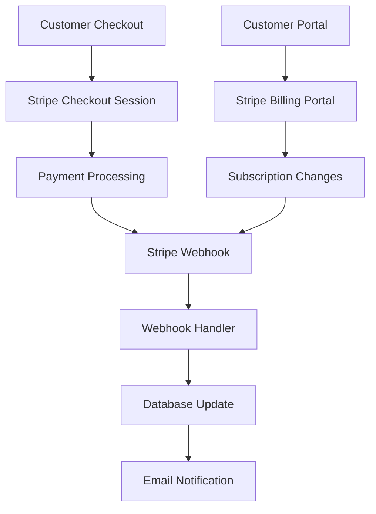

# Stripe Payment Integration

The SaaS Starter includes a complete Stripe integration for subscription management, billing, and payment processing. Built with webhooks, automated setup scripts, and comprehensive error handling.

## Overview

Our Stripe integration provides:

- **Subscription Management**: Complete subscription lifecycle with upgrades/downgrades
- **Billing Portal**: Customer self-service billing management
- **Webhook Processing**: Real-time event handling for payment updates
- **Automated Setup**: Scripts to configure products and pricing automatically
- **Type Safety**: Zod validation for all Stripe metadata and webhooks

## Quick Links

### 📋 Implementation Guides

- **[Integration Overview](./stripe-integration)** - Architecture and implementation details
- **[Setup Script Guide](./setup-script-guide)** - Automated Stripe account configuration
- **[Webhooks Configuration](./webhooks-configuration)** - Real-time event processing
- **[Checkout & Billing Portal](./checkout-and-billing-portal)** - Subscription flows
- **[Metadata Validation](./stripe-metadata-validation.md)** - Type-safe Stripe data handling

### 🔑 Key Features

- **Complete Subscription Flow**: From signup to billing management
- **Webhook Integration**: Real-time synchronization with Stripe events
- **Customer Portal**: Self-service subscription and billing management
- **Automated Setup**: One-command Stripe configuration
- **Error Handling**: Comprehensive error handling and retry logic

### 🚀 Quick Start

1. **Stripe Account Setup**: Create your Stripe account and get API keys
2. **Environment Configuration**: Add Stripe keys to your environment
3. **Run Setup Script**: `node scripts/setup-stripe-features.js`
4. **Configure Webhooks**: Set up webhook endpoints for real-time updates
5. **Test Integration**: Use test cards to verify payment flows

## Architecture

The integration ensures seamless payment processing while maintaining data consistency between Stripe and your application database.

## Test Data

For development and testing:

- **Test Card**: `4242 4242 4242 4242`
- **Expiry**: Any future date
- **CVC**: Any 3-digit number
- **Test Webhooks**: Use Stripe CLI for local webhook testing

## Support

For Stripe-related issues:

- Check the [Stripe Integration Guide](./stripe-integration) for detailed implementation
- Review webhook logs in the Stripe Dashboard
- Use the setup script to verify your configuration
- Test with Stripe's test mode before going live
