# In-App Notification System Implementation Plan

**Created:** September 30, 2025
**Status:** Draft
**Priority:** High
**Estimated Effort:** 7-10 days
**Complexity:** Medium

## Executive Summary

This implementation plan outlines the development of a comprehensive in-app notification system for the SaaS starter application. The system will support notification creation, persistent storage in PostgreSQL, categorization for easy consumption, and a modern notification center UI. The architecture is optimized for serverless deployment with Next.js 15, leveraging SWR for periodic polling (30-second intervals) with a clear upgrade path to real-time delivery in the future.

## Current State Analysis

### ✅ Existing Infrastructure

- Next.js 15 with App Router (serverless-friendly)
- PostgreSQL database with Drizzle ORM
- BetterAuth session management
- Winston logging system
- Activity logs system (`activityLogs` table)
- Organization and user multi-tenancy
- Email notification system via Resend
- SWR for client-side data fetching with revalidation

### ❌ Missing Critical Features

1. **Notification Infrastructure:**
   - No in-app notification storage or delivery
   - No notification center UI component
   - No notification categorization system
   - No read/unread state management
   - No notification preferences system

2. **Event-Driven Notifications:**
   - No event-to-notification mapping
   - No notification creation service
   - No notification delivery tracking

3. **User Experience:**
   - No notification bell icon with badge count
   - No notification feed/inbox
   - No notification grouping or filtering
   - No notification actions (mark as read, dismiss, etc.)

## Technical Analysis

### SaaS Notification Best Practices (2025)

Based on industry research, modern SaaS notification systems should:

1. **Categorization Strategy:**
   - **By Priority:** Critical (red), Important (yellow), Informational (blue)
   - **By Type:** System, Security, Billing, Team, Activity, Product Updates
   - **By Channel:** In-app, Email, Push (future)
   - **By Action Required:** Actionable vs. Informational

2. **UX Best Practices:**
   - Display one notification at a time (toast/banner)
   - Persistent notification center for history
   - Clear, concise microcopy
   - Personalized based on user context
   - Grouped by category and time
   - Action buttons for quick responses
   - Mark all as read functionality

3. **Delivery Patterns:**
   - Periodic polling for active users (SWR revalidation)
   - Persistent storage for all users
   - Email fallback for critical notifications
   - Notification batching to avoid fatigue

### Serverless Architecture Trade-offs

**Decision: Polling-Based Approach**

For this implementation, we use **SWR polling (30-second intervals)** instead of real-time delivery (WebSockets/SSE) for several reasons:

**Why Polling:**

- ✅ Serverless-friendly (no persistent connections)
- ✅ Simple to implement and debug
- ✅ No additional infrastructure costs
- ✅ Works reliably across all browsers
- ✅ Automatic reconnection on network issues
- ✅ 30-second delay acceptable for most notifications

**Challenges with Real-Time in Serverless:**

- ❌ WebSockets require persistent connections (incompatible with serverless)
- ❌ SSE has timeout limitations (10-30s in most serverless platforms)
- ❌ Requires additional infrastructure (Redis pub/sub, dedicated workers)
- ❌ More complex error handling and reconnection logic
- ❌ Higher infrastructure costs

**Future Enhancement Path:**

When real-time delivery becomes critical for UX, consider:

1. **Pusher/Ably** - Managed WebSocket services (easiest)
2. **Supabase Realtime** - PostgreSQL-based real-time subscriptions
3. **Self-hosted WebSocket server** - Separate from serverless API (full control)

For now, 30-second polling provides excellent UX with minimal complexity.

### Tech Stack Selection

| Component     | Technology           | Rationale                             |
| ------------- | -------------------- | ------------------------------------- |
| Storage       | PostgreSQL           | Already in use, ACID compliance       |
| Data Fetching | SWR                  | Optimistic UI, automatic revalidation |
| Type Safety   | Zod + TypeScript     | Runtime + compile-time validation     |
| UI Components | Radix UI + shadcn/ui | Accessible, customizable              |
| Design System | Existing tokens      | Consistent with app design            |

## Dependencies & Prerequisites

### NPM Packages

```bash
# Already installed - no new dependencies needed!
swr                              # Data fetching with polling
zod                              # Runtime validation
@radix-ui/react-popover         # Notification center UI
@radix-ui/react-dropdown-menu   # Menu components
lucide-react                    # Icons
drizzle-orm                     # Database ORM
```

### Environment Variables

Add to `.env.example` and environment files:

```bash
# Notification Configuration
NOTIFICATION_DEFAULT_TTL=2592000  # 30 days in seconds (optional)
NOTIFICATION_POLLING_INTERVAL=30000  # 30 seconds for SWR polling (optional)
NOTIFICATION_MAX_BATCH_SIZE=50  # Max notifications per fetch (optional)

# No additional external services required!
# Uses existing PostgreSQL database
```

## Architecture Overview

### System Design

```
┌─────────────────────────────────────────────────────────────┐
│                    Application Layer                         │
│           (Server Actions, API Routes, Services)             │
└────────────────────┬────────────────────────────────────────┘
                     │
                     ▼
┌─────────────────────────────────────────────────────────────┐
│              Notification Service                            │
│  ┌─────────────────────────────────────────────────────┐    │
│  │  createNotification()                                │    │
│  │  • Validates event with Zod                          │    │
│  │  • Inserts to PostgreSQL                             │    │
│  │  • Logs activity                                     │    │
│  │  • Returns immediately                               │    │
│  └──────────────────┬──────────────────────────────────┘    │
└────────────────────┬┴──────────────────────────────────────┘
                     │
                     ▼
┌─────────────────────────────────────────────────────────────┐
│                  PostgreSQL Database                         │
│  • Persistent notification storage                           │
│  • Indexed queries (userId, isRead, createdAt)               │
│  • Auto-cleanup via expiry timestamps                        │
└────────────────────┬────────────────────────────────────────┘
                     │
                     ▼
┌─────────────────────────────────────────────────────────────┐
│                  API Routes                                  │
│  ┌──────────────────────────────────────────────────────┐   │
│  │  GET /api/notifications                              │   │
│  │  • Fetch user notifications with filters            │   │
│  │  • Pagination support                                │   │
│  │  • Returns unread count                              │   │
│  └──────────────────────────────────────────────────────┘   │
│  ┌──────────────────────────────────────────────────────┐   │
│  │  PATCH /api/notifications/[id]                       │   │
│  │  • Mark as read/unread                               │   │
│  │  • Dismiss notification                              │   │
│  └──────────────────────────────────────────────────────┘   │
└────────────────────┬────────────────────────────────────────┘
                     │
                     ▼
┌─────────────────────────────────────────────────────────────┐
│                  Client Layer (React)                        │
│  ┌─────────────────────────────────────────────────────┐    │
│  │  NotificationProvider (SWR)                          │    │
│  │  • Polls every 30 seconds                            │    │
│  │  • Revalidates on focus/reconnect                    │    │
│  │  • Updates badge count                               │    │
│  │  • Shows toast for new notifications                 │    │
│  │  • Optimistic UI updates                             │    │
│  └─────────────────────────────────────────────────────┘    │
│  ┌─────────────────────────────────────────────────────┐    │
│  │  NotificationCenter Component                        │    │
│  │  • Dropdown/popover UI                               │    │
│  │  • Grouped by category/time                          │    │
│  │  • Mark as read/unread                               │    │
│  │  • Filter by category                                │    │
│  │  • Pagination (load more)                            │    │
│  └─────────────────────────────────────────────────────┘    │
└─────────────────────────────────────────────────────────────┘
```

### Notification Flow

```mermaid
sequenceDiagram
    participant App as Application
    participant NS as NotificationService
    participant DB as PostgreSQL
    participant Client as User Browser (SWR)

    App->>NS: createNotification(event)
    NS->>NS: Validate with Zod
    NS->>DB: Insert notification
    NS->>NS: Log activity
    NS-->>App: Return ✓

    Note over Client: SWR polls every 30s
    Client->>DB: GET /api/notifications
    DB-->>Client: Return notifications + unread count
    Client->>Client: Update UI (toast + badge)

    Note over Client: User actions
    Client->>DB: PATCH /api/notifications/[id] (mark read)
    DB-->>Client: Success
    Client->>Client: Optimistic UI update
```



## Data Model

### Database Schema

#### notifications Table

```typescript
// lib/db/schemas/notification.table.ts
import {
  pgTable,
  pgEnum,
  serial,
  text,
  timestamp,
  boolean,
  jsonb,
  index,
} from 'drizzle-orm/pg-core';
import { sql } from 'drizzle-orm';
import { user } from './user.table';
import {
  NOTIFICATION_PRIORITIES,
  NOTIFICATION_CATEGORIES,
  NOTIFICATION_TYPES,
} from '@/lib/types/notifications';

/**
 * PostgreSQL enums derived from TypeScript constants.
 * Single source of truth ensures consistency across DB, types, and validation.
 */
export const notificationPriorityEnum = pgEnum(
  'notification_priority',
  NOTIFICATION_PRIORITIES
);
export const notificationCategoryEnum = pgEnum(
  'notification_category',
  NOTIFICATION_CATEGORIES
);
export const notificationTypeEnum = pgEnum(
  'notification_type',
  NOTIFICATION_TYPES
);

/**
 * Notifications table
 */
export const notifications = pgTable(
  'notifications',
  {
    id: serial('id').primaryKey(), // ✅ Auto-incrementing ID
    userId: text('user_id')
      .notNull()
      .references(() => user.id, { onDelete: 'cascade' }),
    // ✅ No organizationId - query via user → member → organization

    // Content (using pgEnum for type safety)
    type: notificationTypeEnum('type').notNull(),
    category: notificationCategoryEnum('category').notNull(),
    priority: notificationPriorityEnum('priority').notNull().default('info'),
    title: text('title').notNull(),
    message: text('message').notNull(),
    metadata: jsonb('metadata').$type<NotificationMetadata>(),

    // State
    isRead: boolean('is_read').notNull().default(false),
    readAt: timestamp('read_at'),
    isDismissed: boolean('is_dismissed').notNull().default(false),

    // Timestamps
    createdAt: timestamp('created_at').notNull().defaultNow(),
    expiresAt: timestamp('expires_at'),
  },
  (table) => ({
    // Optimized indexes for common queries
    userCreatedIdx: index('idx_notifications_user_created').on(
      table.userId,
      table.createdAt.desc()
    ),
    userUnreadIdx: index('idx_notifications_user_unread')
      .on(table.userId, table.isRead)
      .where(sql`${table.isRead} = false`),
    expiresIdx: index('idx_notifications_expires')
      .on(table.expiresAt)
      .where(sql`${table.expiresAt} IS NOT NULL`),
  })
);

export type Notification = typeof notifications.$inferSelect;
export type NewNotification = typeof notifications.$inferInsert;
```

#### notification_preferences Table (Phase 2)

```typescript
// lib/db/schemas/notification-preference.table.ts
{
  id: serial('id').primaryKey(),
  userId: text('user_id').notNull().references(() => user.id, { onDelete: 'cascade' }),

  // Preferences per category
  category: text('category').notNull(),
  inAppEnabled: boolean('in_app_enabled').notNull().default(true),
  emailEnabled: boolean('email_enabled').notNull().default(true),

  // Unique constraint on (userId, category)
}
```

### Type System

#### Constants (Single Source of Truth)

```typescript
// lib/types/notifications/notification-priority.constant.ts
/**
 * Single source of truth for notification priorities.
 * Used for: TypeScript types, Zod schemas, and pgEnum definitions.
 */
export const NOTIFICATION_PRIORITIES = [
  'critical',
  'important',
  'info',
] as const;

/**
 * TypeScript type derived from the constant array.
 * - critical: Red - requires immediate action
 * - important: Yellow - should be addressed soon
 * - info: Blue - informational only
 */
export type NotificationPriority = (typeof NOTIFICATION_PRIORITIES)[number];

// lib/types/notifications/notification-category.constant.ts
/**
 * Single source of truth for notification categories.
 */
export const NOTIFICATION_CATEGORIES = [
  'system',
  'security',
  'billing',
  'team',
  'activity',
  'product',
] as const;

export type NotificationCategory = (typeof NOTIFICATION_CATEGORIES)[number];

// lib/types/notifications/notification-type.constant.ts
/**
 * Single source of truth for notification types.
 * When you change a value here, TypeScript will error everywhere it's used.
 */
export const NOTIFICATION_TYPES = [
  'system.maintenance',
  'system.update',
  'security.password_changed',
  'security.login_new_device',
  'security.two_factor_enabled',
  'billing.payment_success',
  'billing.payment_failed',
  'billing.subscription_created',
  'billing.subscription_canceled',
  'billing.trial_ending',
  'team.invitation_received',
  'team.invitation_accepted',
  'team.member_added',
  'team.member_removed',
  'team.role_changed',
  'activity.comment_mention',
  'activity.task_assigned',
  'product.feature_released',
  'product.announcement',
] as const;

export type NotificationType = (typeof NOTIFICATION_TYPES)[number];
```

#### Core Types

```typescript
// lib/types/notifications/notification.type.ts
/**
 * Notification type (inferred from database schema)
 */
export type Notification = {
  id: number; // ✅ Serial ID
  userId: string;
  // ✅ No organizationId - query via user relations
  type: NotificationType;
  category: NotificationCategory;
  priority: NotificationPriority;
  title: string;
  message: string;
  metadata: NotificationMetadata | null;
  isRead: boolean;
  readAt: Date | null;
  isDismissed: boolean;
  createdAt: Date;
  expiresAt: Date | null;
};

// lib/types/notifications/notification-metadata.type.ts
export type NotificationMetadata = {
  actionUrl?: string;
  actionLabel?: string;
  actorId?: string;
  actorName?: string;
  entityId?: string;
  entityType?: string;
  imageUrl?: string;
  [key: string]: unknown;
};

// lib/types/notifications/notification-event.schema.ts (Zod Schema)
import { z } from 'zod';
import {
  NOTIFICATION_TYPES,
  NOTIFICATION_PRIORITIES,
  NOTIFICATION_CATEGORIES,
} from './constants';

/**
 * Zod schema for notification event validation.
 * Uses the same constant arrays as pgEnum for consistency.
 */
export const notificationEventSchema = z.object({
  userId: z.string().min(1),
  type: z.enum(NOTIFICATION_TYPES), // ✅ Single source of truth
  category: z.enum(NOTIFICATION_CATEGORIES).optional(), // Auto-derived from type
  priority: z.enum(NOTIFICATION_PRIORITIES).default('info'),
  title: z.string().min(1).max(255),
  message: z.string().min(1).max(1000),
  metadata: z.record(z.unknown()).optional(),
});

export type NotificationEvent = z.infer<typeof notificationEventSchema>;
```

## Implementation Phases

### Phase 1: Database & Type System (Days 1-2)

#### 1.1 Type System (Single Source of Truth)

**Files to create:**

- `lib/types/notifications/notification-priority.constant.ts`
- `lib/types/notifications/notification-category.constant.ts`
- `lib/types/notifications/notification-type.constant.ts`
- `lib/types/notifications/notification.type.ts`
- `lib/types/notifications/notification-metadata.type.ts`
- `lib/types/notifications/notification-event.schema.ts` (Zod)
- `lib/types/notifications/index.ts`

**Tasks:**

- ✅ Define constant arrays with `as const` for single source of truth
- ✅ Create TypeScript types derived from constants
- ✅ Create Zod schemas using same constants for validation
- ✅ Export from index file for clean imports

**Example:**

```typescript
// notification-priority.constant.ts
export const NOTIFICATION_PRIORITIES = [
  'critical',
  'important',
  'info',
] as const;
export type NotificationPriority = (typeof NOTIFICATION_PRIORITIES)[number];
```

#### 1.2 Database Schema & Migrations

**Files to create:**

- `lib/db/schemas/notification.table.ts`
- `lib/db/schemas/notification-preference.table.ts` (Phase 2)
- Update `lib/db/schemas/index.ts`
- Generate migration: `pnpm db:generate`

**Tasks:**

- ✅ Create `notifications` table with pgEnum using constant arrays
- ✅ Use `serial` for auto-incrementing ID
- ✅ Remove `organizationId` (query via relations)
- ✅ Add optimized indexes (userId, isRead, createdAt, expiresAt)
- ✅ Add foreign key relationships with cascade delete
- ✅ Export type inference

**Key Details:**

```typescript
export const notificationPriorityEnum = pgEnum(
  'notification_priority',
  NOTIFICATION_PRIORITIES
);
// When NOTIFICATION_PRIORITIES changes, TypeScript errors everywhere!
```

### Phase 2: Service Layer & Business Logic (Days 2-3)

#### 2.1 Notification Service

**Files to create:**

- `lib/notifications/notification.service.ts`
- `lib/notifications/notification.query.ts`
- `lib/notifications/notification.repository.ts`

**Features:**

- ✅ Create notification (direct DB insert, no queue)
- ✅ Batch create notifications
- ✅ Mark as read/unread
- ✅ Dismiss notification
- ✅ Get user notifications with filters
- ✅ Get unread count with PostgreSQL aggregation
- ✅ Cleanup expired notifications

**Key Functions:**

```typescript
async createNotification(event: NotificationEvent): Promise<void> {
  // Validate with Zod
  const validated = notificationEventSchema.parse(event);

  // Direct insert to PostgreSQL
  await db.insert(notifications).values({
    ...validated,
    category: deriveCategory(validated.type),
    expiresAt: new Date(Date.now() + 30 * 24 * 60 * 60 * 1000),
  });
}

async batchCreateNotifications(events: NotificationEvent[]): Promise<void>
async markAsRead(notificationId: number, userId: string): Promise<void>
async markAllAsRead(userId: string): Promise<void>
async dismissNotification(notificationId: number, userId: string): Promise<void>
async getUserNotifications(userId: string, filters?: NotificationFilters): Promise<Notification[]>
async getUnreadCount(userId: string): Promise<number>
```

### Phase 3: API Layer (Days 3-4)

#### 3.1 Notification API Routes

**Files to create:**

- `app/api/notifications/route.ts` (GET - list, POST - create)
- `app/api/notifications/[id]/route.ts` (PATCH - update)
- `app/api/notifications/unread-count/route.ts` (GET)
- `app/api/notifications/mark-all-read/route.ts` (POST)

**Features:**

- RESTful API for notification operations
- Authentication and authorization
- Pagination support
- Filtering by category/type/priority
- Rate limiting (reuse existing patterns)

#### 3.2 Server Actions

**Files to create:**

- `app/actions/notifications/mark-as-read.action.ts`
- `app/actions/notifications/mark-all-as-read.action.ts`
- `app/actions/notifications/dismiss-notification.action.ts`

**Features:**

- Type-safe server actions using `validatedActionWithUser`
- Zod validation
- Error handling

### Phase 4: Client Components (Days 4-6)

#### 4.1 Notification Provider (SWR Polling)

**Files to create:**

- `components/notifications/notification-provider.component.tsx`
- `components/notifications/use-notifications.hook.ts`

**Features:**

- ✅ React Context for notification state
- ✅ SWR polling every 30 seconds (no SSE/WebSocket)
- ✅ Revalidation on window focus and reconnect
- ✅ Toast notifications for new items
- ✅ Unread count management
- ✅ Optimistic UI updates

**Key Implementation:**

```typescript
// use-notifications.hook.ts
export function useNotifications() {
  const { data, error, isLoading, mutate } = useSWR(
    '/api/notifications',
    fetcher,
    {
      refreshInterval: 30000, // Poll every 30 seconds
      revalidateOnFocus: true,
      revalidateOnReconnect: true,
      dedupingInterval: 10000, // Prevent duplicate requests
    }
  );

  return {
    notifications: data?.notifications || [],
    unreadCount: data?.unreadCount || 0,
    isLoading,
    error,
    markAsRead,
    markAllAsRead,
    dismiss,
    refetch: mutate,
  };
}
```

#### 4.2 Notification Bell Component

**Files to create:**

- `components/notifications/notification-bell.component.tsx`

**Features:**

- Bell icon with badge count
- Animated badge for new notifications
- Click to open notification center
- Keyboard navigation support (Escape to close)

**Design:**

- Use `lucide-react` Bell icon
- Radix UI Popover for dropdown
- Badge with unread count
- Pulse animation for new notifications

#### 4.3 Notification Center Component

**Files to create:**

- `components/notifications/notification-center.component.tsx`
- `components/notifications/notification-item.component.tsx`
- `components/notifications/notification-empty.component.tsx`
- `components/notifications/notification-filters.component.tsx`

**Features:**

- Dropdown/popover UI (max-height with scroll)
- Grouped by time (Today, Yesterday, This Week, Earlier)
- Category icons and colors
- Priority badges (critical = red, important = yellow, info = blue)
- Mark as read/unread toggle
- Dismiss button
- "Mark all as read" button
- Filter by category (tabs/pills)
- Pagination (infinite scroll or "Load more")
- Empty state with illustration
- Action buttons (if metadata.actionUrl exists)

**Layout:**

```
┌─────────────────────────────────────────┐
│ Notifications          [Mark all read]  │
├─────────────────────────────────────────┤
│ [All] [System] [Security] [Billing]...  │
├─────────────────────────────────────────┤
│ Today                                    │
│ ┌─────────────────────────────────────┐ │
│ │ 🔴 [!] Payment failed                │ │
│ │     Your payment could not be...     │ │
│ │     2 min ago          [View] [✕]    │ │
│ └─────────────────────────────────────┘ │
│ ┌─────────────────────────────────────┐ │
│ │ 👤 John invited you to Team Alpha    │ │
│ │     3 hours ago        [Join] [✕]    │ │
│ └─────────────────────────────────────┘ │
│ Yesterday                                │
│ ┌─────────────────────────────────────┐ │
│ │ ✓ Subscription created               │ │
│ │     Yesterday at 4:32 PM       [✕]   │ │
│ └─────────────────────────────────────┘ │
│                                          │
│         [View all notifications]         │
└─────────────────────────────────────────┘
```

#### 4.4 Toast Notification Component

**Files to create:**

- `components/notifications/notification-toast.component.tsx`

**Features:**

- Transient notification for new items
- Auto-dismiss after 5 seconds
- Action buttons (inline)
- Close button
- Stacked toasts (max 3 visible)
- Slide-in animation from top-right

**Note:** Can leverage existing toast patterns or use Radix UI Toast

#### 4.5 Integration with Layout

**Files to modify:**

- `app/(app)/app-header.component.tsx` or equivalent

**Tasks:**

- Add NotificationBell component to header
- Wrap app layout with NotificationProvider
- Position bell next to user avatar/settings

### Phase 5: Event Triggers & Integration (Day 6-7)

#### 5.1 Define Notification Events

**Files to create:**

- `lib/notifications/events/system-events.ts`
- `lib/notifications/events/security-events.ts`
- `lib/notifications/events/billing-events.ts`
- `lib/notifications/events/team-events.ts`
- `lib/notifications/events/index.ts`

**Features:**

- Helper functions to create event payloads
- Type-safe event builders
- Default metadata population

**Example:**

```typescript
// lib/notifications/events/billing-events.ts
export function paymentFailedEvent(
  userId: string,
  amount: number
): NotificationEvent {
  return {
    userId,
    type: 'billing.payment_failed',
    priority: 'critical',
    title: 'Payment Failed',
    message: `Your payment of $${amount} could not be processed. Please update your payment method.`,
    metadata: {
      actionUrl: '/settings/billing',
      actionLabel: 'Update Payment',
    },
  };
}
```

#### 5.2 Integrate with Existing Flows

**Files to modify:**

- `app/api/stripe/webhook/route.ts` - Billing events
- `app/actions/team/invite-user.action.ts` - Team events
- `app/actions/auth/*` - Security events
- Any other relevant action files

**Tasks:**

- Add `createNotification()` calls after key actions
- Pass appropriate event data
- Ensure async/non-blocking execution
- Add error handling (don't fail main flow if notification fails)

**Example Integration:**

```typescript
// In Stripe webhook handler
if (event.type === 'invoice.payment_failed') {
  const subscription = await getSubscription(invoice.subscription);
  const organization = await getOrgByStripeCustomerId(invoice.customer);

  // Create notification (async, non-blocking)
  await createNotification(
    paymentFailedEvent(organization.ownerId, invoice.amount_due / 100)
  ).catch((err) => logger.error('Failed to create notification', err));
}
```

### Phase 6: Testing & Documentation (Days 7-8)

#### 6.1 Unit Tests

**Files to create:**

- `tests/notifications/notification.service.test.ts`
- `tests/notifications/notification-queue.service.test.ts`
- `tests/notifications/notification.query.test.ts`

**Test Coverage:**

- Service methods
- Queue operations
- Database queries
- Event builders

#### 6.2 Integration Tests

**Files to create:**

- `tests/notifications/notification-flow.test.ts`

**Test Scenarios:**

- Create notification → Queue → Process → Deliver
- Mark as read/unread
- Filter and pagination
- Expired notification cleanup

#### 6.3 E2E Tests (Manual)

**Test Cases:**

- Notification appears in notification center after polling interval
- Badge count updates correctly
- Mark as read functionality
- Dismiss functionality
- Filters work correctly
- Polling continues after window focus/blur
- Optimistic UI updates work correctly

#### 6.4 Documentation

**Files to create:**

- `docs/features/notifications.md`

**Content:**

- Architecture overview
- How to create notifications
- Available notification types
- Event trigger examples
- API reference
- Client component usage
- Troubleshooting guide

**Note:** Comprehensive unit tests and documentation are included in Phase 6 above.

## Configuration Files

### Notification Constants

```typescript
// lib/notifications/notification.config.ts

/**
 * Notification system configuration
 */
export const NOTIFICATION_CONFIG = {
  // Default expiry: 30 days
  DEFAULT_TTL_MS: 30 * 24 * 60 * 60 * 1000,

  // SWR polling interval: 30 seconds
  POLLING_INTERVAL_MS: 30000,

  // Max notifications per page
  PAGE_SIZE: 20,

  // Max notifications to fetch
  MAX_BATCH_SIZE: 50,
} as const;
```

### Optional: Cleanup Cron Job

If you want automated cleanup of expired notifications, add a cron job:

```json
// vercel.json (optional)
{
  "crons": [
    {
      "path": "/api/notifications/cleanup",
      "schedule": "0 2 * * *"
    }
  ]
}
```

```typescript
// app/api/notifications/cleanup/route.ts
import { cleanupExpiredNotifications } from '@/lib/notifications/notification.service';

export async function POST() {
  await cleanupExpiredNotifications();
  return Response.json({ success: true });
}
```

## Performance Considerations

### Optimization Strategies

1. **Database Indexes:**

   Already defined in schema using Drizzle:

   ```typescript
   userCreatedIdx: index().on(table.userId, table.createdAt.desc()),
   userUnreadIdx: index().on(table.userId, table.isRead).where(sql`is_read = false`),
   expiresIdx: index().on(table.expiresAt).where(sql`expires_at IS NOT NULL`),
   ```

2. **Pagination:**
   - Cursor-based pagination for better performance
   - Limit default page size to 20 items
   - Load more on scroll/button click
   - Use `WHERE id > lastId ORDER BY id DESC LIMIT 20`

3. **SWR Optimization:**
   - `refreshInterval: 30000` - Poll every 30s
   - `dedupingInterval: 10000` - Prevent duplicate requests within 10s
   - `revalidateOnFocus: true` - Refresh when user returns to tab
   - `revalidateOnReconnect: true` - Refresh when network reconnects

4. **Query Optimization:**
   - Fetch only necessary fields (avoid `SELECT *`)
   - Use PostgreSQL aggregation for unread count
   - Limit initial fetch to 20 most recent notifications
   - Consider materialized views for complex queries

5. **Cleanup:**
   - Optional daily cron job to delete expired notifications
   - Default expiry: 30 days after creation
   - Batch delete to avoid long transactions
   - Can also cleanup on read (delete if expired)

6. **Rate Limiting:**
   - Limit notification creation per user: 100/hour
   - Prevent notification spam in service layer
   - Use in-memory tracking or existing cache system

## Security Considerations

### Authentication & Authorization

1. **API Routes:**
   - All routes require authentication via BetterAuth
   - Users can only access own notifications
   - Validate userId from session matches notification.userId
   - Use `requireServerContext()` for user verification

2. **Server Actions:**
   - Use `validatedActionWithUser` wrapper
   - Validate user owns notification before update
   - Prevent CSRF with built-in Next.js protection

3. **Query Security:**
   - Always filter by userId from session (never trust client input)
   - Use parameterized queries to prevent SQL injection
   - Validate notification ID ownership before updates

### Data Privacy

1. **Sensitive Data:**
   - Never include passwords or tokens in notifications
   - Sanitize user input in metadata
   - Limit metadata size (max 5KB)

2. **Retention:**
   - Auto-delete after expiry date
   - Allow users to delete notifications
   - GDPR compliance: delete user notifications on account deletion

## Migration Strategy

### Database Migration

Drizzle will generate the migration automatically. Run:

```bash
pnpm db:generate  # Generate migration from schema
pnpm db:migrate   # Apply migration to database
```

Expected generated SQL:

```sql
-- Create enums
CREATE TYPE notification_priority AS ENUM ('critical', 'important', 'info');
CREATE TYPE notification_category AS ENUM ('system', 'security', 'billing', 'team', 'activity', 'product');
CREATE TYPE notification_type AS ENUM (
  'system.maintenance', 'system.update',
  'security.password_changed', 'security.login_new_device', 'security.two_factor_enabled',
  'billing.payment_success', 'billing.payment_failed', 'billing.subscription_created', 'billing.subscription_canceled', 'billing.trial_ending',
  'team.invitation_received', 'team.invitation_accepted', 'team.member_added', 'team.member_removed', 'team.role_changed',
  'activity.comment_mention', 'activity.task_assigned',
  'product.feature_released', 'product.announcement'
);

-- Create notifications table
CREATE TABLE notifications (
  id SERIAL PRIMARY KEY,
  user_id TEXT NOT NULL REFERENCES "user"(id) ON DELETE CASCADE,
  type notification_type NOT NULL,
  category notification_category NOT NULL,
  priority notification_priority NOT NULL DEFAULT 'info',
  title TEXT NOT NULL,
  message TEXT NOT NULL,
  metadata JSONB,
  is_read BOOLEAN NOT NULL DEFAULT false,
  read_at TIMESTAMP,
  is_dismissed BOOLEAN NOT NULL DEFAULT false,
  created_at TIMESTAMP NOT NULL DEFAULT NOW(),
  expires_at TIMESTAMP
);

-- Create indexes
CREATE INDEX idx_notifications_user_created ON notifications(user_id, created_at DESC);
CREATE INDEX idx_notifications_user_unread ON notifications(user_id, is_read) WHERE is_read = false;
CREATE INDEX idx_notifications_expires ON notifications(expires_at) WHERE expires_at IS NOT NULL;
```

### Rollback Plan

If issues arise:

1. Remove NotificationProvider from layout (disable UI)
2. Revert database migrations (`pnpm db:rollback`)
3. Remove notification creation calls from application code
4. Drop notification tables and enums
5. Restore previous version from git

## Future Enhancements (Not in Scope)

### Phase 2 Features

1. **Real-Time Delivery (High Priority):**
   - When polling delay becomes a UX issue, upgrade to real-time
   - Options:
     - **Pusher/Ably** - Managed WebSocket service (~$49/month)
     - **Supabase Realtime** - PostgreSQL-based subscriptions
     - **Self-hosted WebSocket server** - Separate from serverless API
   - Estimated effort: 2-3 days
   - Keep polling as fallback for reliability

2. **Email Digest:**
   - Daily/weekly digest of unread notifications
   - User preferences for digest frequency
   - Grouped by category
   - Use existing Resend integration

3. **Push Notifications:**
   - Web Push API integration
   - Mobile push (if native apps exist)
   - User opt-in/opt-out
   - Service Worker implementation

4. **Notification Preferences:**
   - Per-category notification settings
   - In-app vs email toggles
   - Quiet hours configuration
   - Notification grouping preferences

5. **Advanced Filtering:**
   - Search notifications by content
   - Date range filters
   - Custom views/saved filters
   - Export notifications

6. **Notification Actions:**
   - In-line actions (approve, reject, etc.)
   - Bulk actions (select multiple)
   - Archive notifications
   - Snooze/remind me later

7. **Analytics:**
   - Notification delivery rates
   - Read rates per type
   - User engagement metrics
   - A/B testing notification copy
   - Time-to-read analysis

## Success Metrics

### Key Performance Indicators

1. **Delivery Performance:**
   - API response time < 200ms (p95)
   - Database query time < 50ms (p95)
   - Notification appears within 30 seconds of creation

2. **User Engagement:**
   - Notification read rate > 60%
   - Time to read < 5 minutes
   - Click-through rate on actions > 30%
   - User dismisses < 10% of notifications

3. **System Health:**
   - Zero notification data loss
   - Uptime > 99.9%
   - Database disk usage < 100MB per 1000 users
   - SWR polling doesn't impact page performance

4. **User Experience:**
   - Zero reported bugs after 2 weeks
   - Positive user feedback
   - No page load performance degradation
   - Notification center loads in < 200ms

## Risk Assessment

### Technical Risks

| Risk                            | Probability | Impact | Mitigation                                            |
| ------------------------------- | ----------- | ------ | ----------------------------------------------------- |
| Database performance issues     | Medium      | High   | Proper indexing, pagination, caching                  |
| 30-second delay too slow for UX | Low         | Medium | Monitor user feedback, upgrade to real-time if needed |
| Polling creates server load     | Low         | Medium | SWR deduping, rate limiting, caching                  |
| TypeScript enum sync issues     | Low         | High   | Single source of truth with `as const` arrays         |
| Notification spam               | Medium      | Medium | Rate limiting, batch grouping                         |

### Business Risks

| Risk                            | Probability | Impact | Mitigation                                        |
| ------------------------------- | ----------- | ------ | ------------------------------------------------- |
| Notification fatigue            | Medium      | High   | User preferences, smart batching, priority levels |
| User confusion with categories  | Low         | Low    | Clear UI labels, tooltips, icons                  |
| Users expect real-time delivery | Low         | Medium | Document 30s delay, upgrade path available        |

## Conclusion

This implementation plan provides a comprehensive roadmap for building a **simple, maintainable notification system** optimized for serverless deployment. The architecture uses SWR polling for delivery and PostgreSQL for persistent storage—no additional infrastructure required.

### Key Benefits

- ✅ **No new dependencies** - Uses existing PostgreSQL + SWR
- ✅ **Serverless-friendly** - No persistent connections required
- ✅ **Single source of truth** - Enums defined once with `as const` arrays
- ✅ **Type-safe** - pgEnum + Zod + TypeScript for full type safety
- ✅ **Simple to maintain** - Direct DB inserts, no queue complexity
- ✅ **Categorized and prioritized** - Rich notification metadata
- ✅ **Modern UI/UX** - Notification center with badge counts and toasts
- ✅ **Extensible** - Easy to upgrade to real-time delivery later
- ✅ **Fast implementation** - 7-8 days vs 10+ for complex real-time approach

### Architecture Highlights

1. **Polling-based delivery** - SWR every 30s (acceptable for most use cases)
2. **PostgreSQL-only storage** - No Redis needed for Phase 1
3. **Type safety everywhere** - Change an enum value → TypeScript errors everywhere
4. **Serial IDs** - Simple auto-incrementing primary keys
5. **No organizationId** - Query via user relations when needed

### Trade-offs Made

| Decision             | Trade-off            | Justification                                   |
| -------------------- | -------------------- | ----------------------------------------------- |
| Polling vs Real-time | 30-second delay      | Acceptable for most notifications, much simpler |
| No queue             | Synchronous creation | Fast enough for single notifications            |
| No Redis             | No caching layer     | PostgreSQL indexes are sufficient               |
| Serial ID            | Non-distributed      | Fine for single PostgreSQL instance             |

### Timeline

**Estimated Timeline:** 7-8 days for full implementation

| Phase | Duration | Deliverable                            |
| ----- | -------- | -------------------------------------- |
| 1     | 1-2 days | Database schema + type system          |
| 2     | 2-3 days | Service layer + business logic         |
| 3     | 3-4 days | API routes + server actions            |
| 4     | 4-6 days | UI components (provider, bell, center) |
| 5     | 6-7 days | Event triggers + integration           |
| 6     | 7-8 days | Testing + documentation                |

### Next Steps

1. ✅ Review and approve this plan
2. ✅ Create type constants with `as const` arrays (Phase 1.1)
3. ✅ Create database schema with pgEnum (Phase 1.2)
4. ✅ Generate and run migrations
5. ✅ Build notification service (Phase 2)
6. ✅ Implement UI components (Phase 4)
7. ✅ Integrate with existing flows (Phase 5)
8. ✅ Test and document (Phase 6)

### Future Enhancement Path

When ready to upgrade to real-time delivery:

- **Option 1:** Pusher/Ably (~$49/month, 2-3 days integration)
- **Option 2:** Supabase Realtime (PostgreSQL-based, 3-4 days)
- **Option 3:** Self-hosted WebSocket server (full control, 5-7 days)

All core functionality remains unchanged—just swap polling for real-time delivery in the client.
